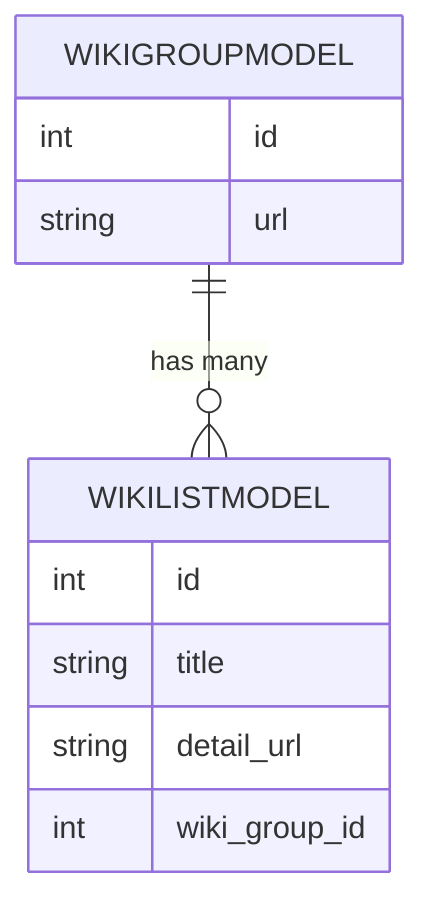

# sqlalchemy の relation

## many-to-one(1:N) one-to-many(N:1) one-to-one(1:1) 構造を設定する

此処では、wikiのアニメに関する情報をクローリングして、DBにデータを保存するような場面を想定します。次のようなモデルを用意しました。

- [アニメ一覧ページ(WikiGroupModel)](note1_models/wiki_group.py)
- [各アニメのデータ(WikiListModel)](note1_models/wiki_list.py)

`WikiGroupModel.url` に対して、クローラでアクセスし、表示されているアニメ一覧を `WikiListModel` を保存します。

er図は、次の様になっています。



`WikiGroupModel` から見れば `WikiListModel` は 1:N で、その逆は N:1 となります。この構造を作るには次の様に設定をしています。

```py
# model: WikiGroupModel(1:N)
wiki_lists = relationship(
    'WikiListModel',
    back_populates='wiki_group',
    cascade="all, delete-orphan"
)

# model: WikiListModel(N:1)
wiki_group = relationship(
    'WikiGroupModel',
    back_populates='wiki_lists',
    uselist=False,
)
```

`back_populates` や `cascade` については公式の資料を参照するとして、今回のポイントは `uselist=False` です。one-to-many 構造において、one側のモデルに `uselist=False` を使います。

`uselist=False` を付けると、関連先が one であることを示し、結果を単一のオブジェクトとして返します。一方で、`uselist=True(default)` の設定をする事で、many であることを表し、結果をリストとして返します。

では、1:1 ではどうすれば良いのか。両方の関連先に `uselist=False` を付ければ良いです。

```py
# model: WikiListModel
wiki_detail = relationship(
    'WikiDetailModel',
    back_populates='wiki_list',
    uselist=False,
)

# model: WikiDetailModel(N:1)
wiki_list = relationship(
    'WikiListModel',
    back_populates='wiki_detail',
    uselist=False,
)
```
